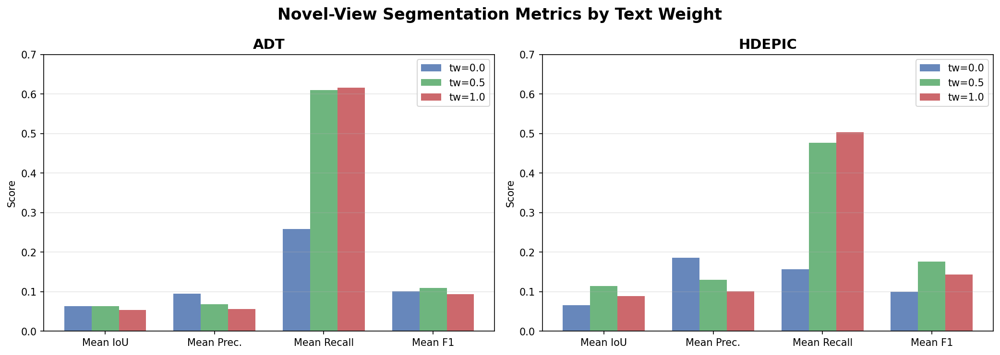
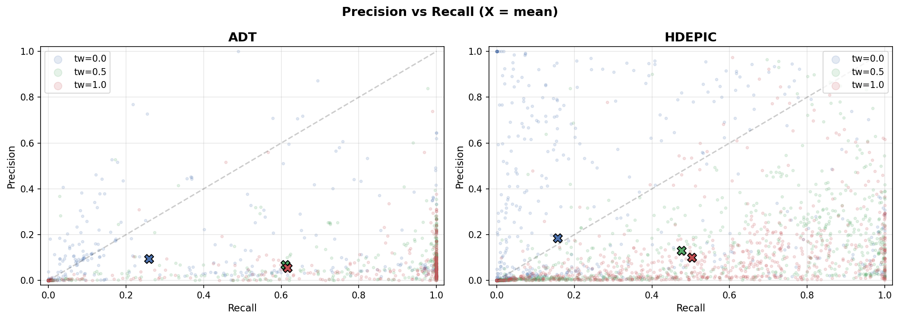
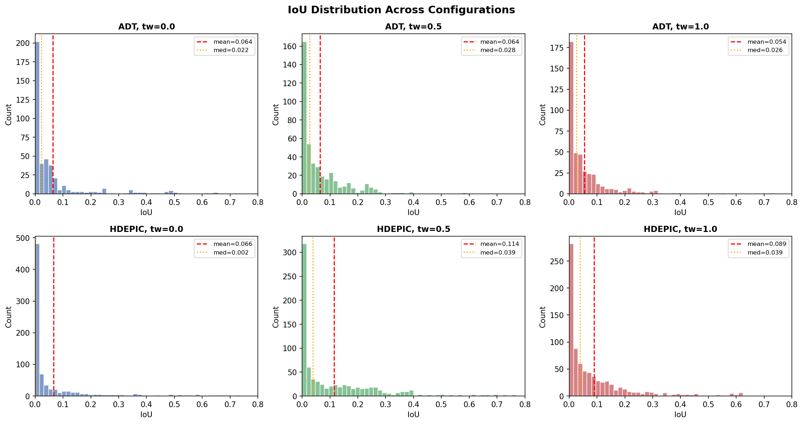
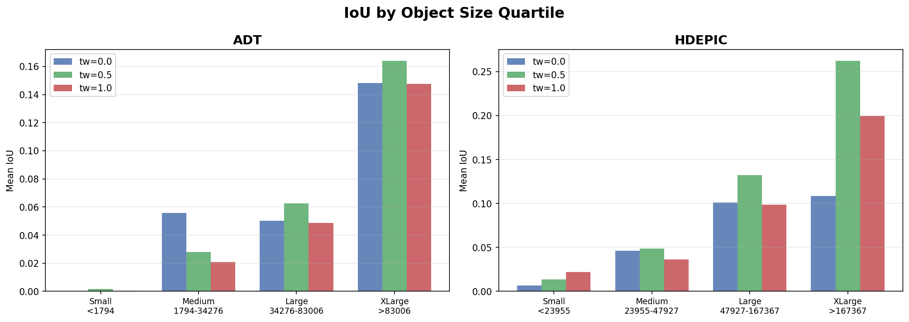
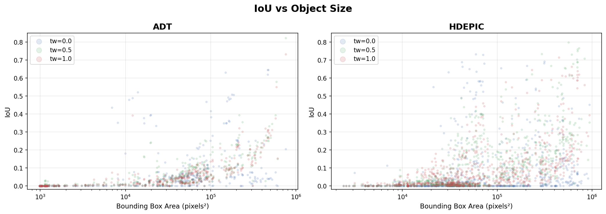
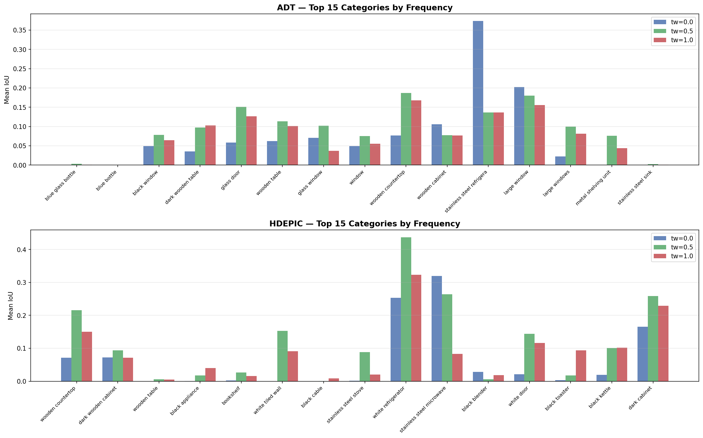
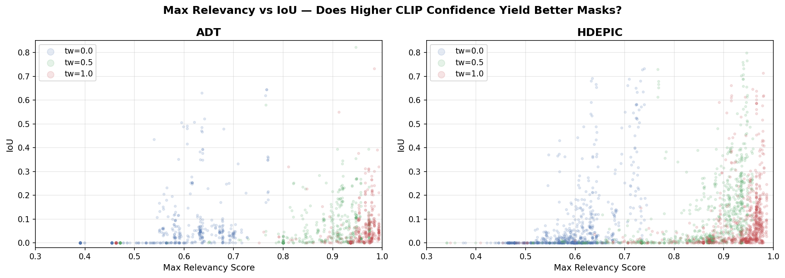
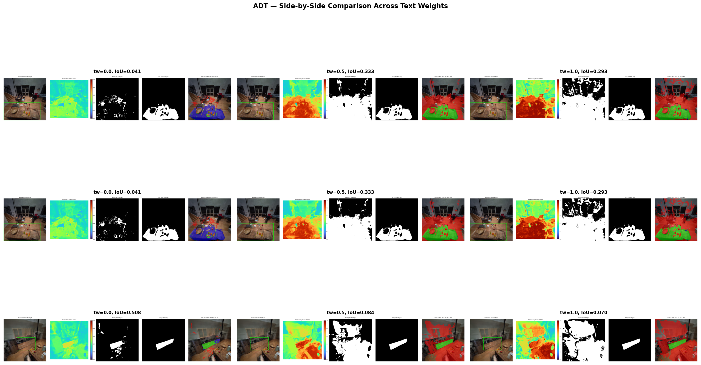
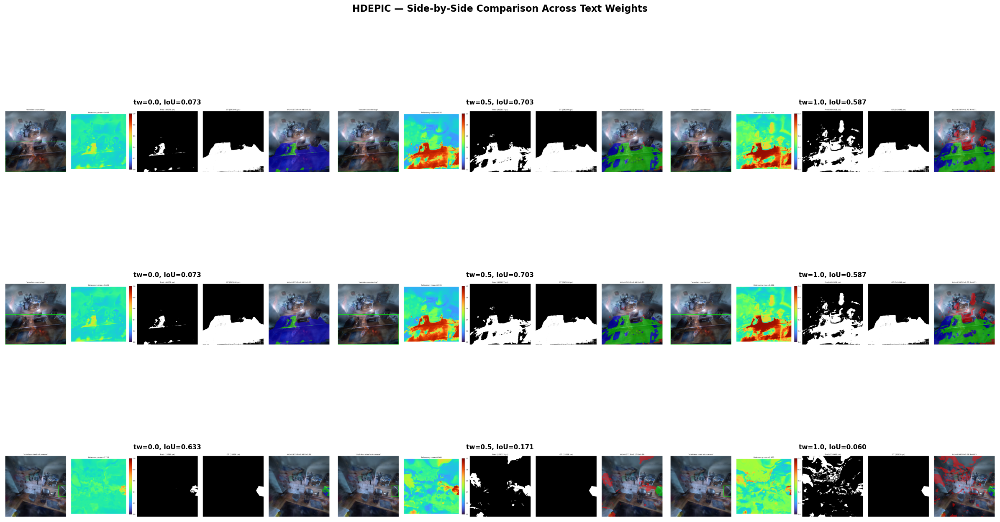

# Novel-View Segmentation Evaluation Report

**LangSplat v2 Experiments** | 2 Datasets x 3 Text Weights | April 2026

---

## 1. Experiment Overview

This report evaluates **open-vocabulary segmentation from novel viewpoints** using LangSplat's language-embedded 3D Gaussian Splatting. The core question: **can LangSplat's learned 3D language features produce meaningful object segmentation when rendered from camera poses the model has never seen during training?**

### Setup

- **Datasets**: ADT (Apartment_release_clean_seq131) and HD-EPIC (P01-20240202-110250)
- **Text weight (tw)**: Controls CLIP text feature blending during training. `tw=0.0` = pure visual CLIP features, `tw=0.5` = 50/50 visual+text, `tw=1.0` = pure text features
- **Novel views**: `moved_050` cameras offset 0.5 units from action-endpoint frames (44 ADT frames / 120 HDEPIC frames, 423 / 790 objects total)
- **Evaluation**: For each object, compute CLIP relevancy heatmap using its category name as text query, threshold at 0.5 to produce a binary mask, and compare against SAM2 ground-truth masks via IoU

### Pipeline

1. **GT mask generation**: SAM2 (Hiera-Large) with VLM bounding-box prompts on moved_050 RGB images
2. **Novel-view rendering**: Load trained LangSplat model, render RGB + 3D language features at moved_050 camera poses
3. **Feature decoding**: 3D compressed features -> 512D CLIP space via trained autoencoder
4. **Segmentation**: Compute per-pixel CLIP relevancy (softmax similarity), threshold at 0.5
5. **Metrics**: IoU, precision, recall, F1 per object; aggregated per category, per size quartile, and overall

---

## 2. Aggregate Results

| Dataset | Text Weight | #Objects | Mean IoU | Median IoU | Mean Prec. | Mean Recall | Mean F1 | IoU>0 | IoU>0.1 | IoU>0.25 |
|---------|------------|---------|---------|-----------|-----------|------------|--------|-------|---------|----------|
| ADT     | 0.0        | 423     | 0.0636  | 0.0222    | 0.0956    | 0.2589     | 0.1014 | 62.4% | 15.6%   | 8.0%     |
| ADT     | 0.5        | 423     | 0.0641  | 0.0275    | 0.0687    | 0.6108     | 0.1092 | 81.3% | 24.1%   | 4.0%     |
| ADT     | 1.0        | 423     | 0.0543  | 0.0257    | 0.0562    | 0.6163     | 0.0935 | 78.5% | 15.6%   | 3.8%     |
| HDEPIC  | 0.0        | 790     | 0.0657  | 0.0015    | 0.1857    | 0.1566     | 0.0996 | 56.2% | 18.7%   | 8.7%     |
| HDEPIC  | 0.5        | 790     | **0.1141** | **0.0388** | 0.1308 | 0.4767     | **0.1764** | **92.4%** | **37.6%** | **16.1%** |
| HDEPIC  | 1.0        | 790     | 0.0891  | 0.0391    | 0.1013    | 0.5033     | 0.1433 | 93.4% | 28.5%   | 9.2%     |

### Key Takeaway

**tw=0.5 is the best overall configuration**, especially on HDEPIC where it achieves nearly 2x the IoU of tw=0.0 (0.114 vs 0.066). The improvement on ADT is marginal (0.064 vs 0.064). tw=1.0 (pure text features) overshoots -- it further increases recall but at the cost of precision, degrading IoU.

---

## 3. Precision-Recall Tradeoff

The most striking pattern across all configs is a **fundamental precision-recall tradeoff controlled by text weight**:

- **tw=0.0 (no text blending)**: High precision (0.19 HDEPIC), low recall (0.16 HDEPIC). The model is conservative -- when it activates, it's often right, but it misses many objects entirely. 43.8% of HDEPIC objects get zero IoU.
- **tw=0.5**: Moderate precision (0.13), dramatically higher recall (0.48). The model activates for 92.4% of objects, capturing nearly everything at the cost of some false positives.
- **tw=1.0**: Lowest precision (0.10), highest recall (0.50). Overactivation -- the language features respond broadly but imprecisely.

**Interpretation**: Text weight blending acts as a sensitivity knob. Pure visual CLIP features (tw=0.0) produce language features that are highly view-dependent and conservative. Adding text information (tw=0.5, 1.0) makes features more semantic and view-invariant, dramatically increasing the model's ability to respond to novel-view queries. The sweet spot is tw=0.5: enough text grounding to generalize, but not so much that spatial specificity is lost.

---

## 4. IoU Distribution Analysis

All distributions are **heavily right-skewed** (long tail toward zero). Key observations:

- **tw=0.0**: Bimodal on HDEPIC -- a large spike at IoU=0 (model completely misses) and a small spread of successful detections
- **tw=0.5**: The zero-spike shrinks dramatically; the distribution shifts rightward with a broader spread
- **tw=1.0**: Similar to tw=0.5 but with slightly more mass concentrated at low IoU values

Even at the best config (HDEPIC tw=0.5), the median IoU is only 0.039, meaning more than half of objects have very low overlap. This is consistent with the difficulty of the task: open-vocabulary segmentation from novel views using a frozen CLIP text query, evaluated pixel-by-pixel against SAM2 masks.

---

## 5. Object Size Matters

Object size is the **strongest predictor of segmentation success**:

| Dataset | TW  | Small (Q1) | Medium (Q2) | Large (Q3) | XLarge (Q4) |
|---------|-----|-----------|-------------|-----------|-------------|
| ADT     | 0.0 | 0.000     | 0.056       | 0.050     | 0.148       |
| ADT     | 0.5 | 0.002     | 0.028       | 0.063     | 0.164       |
| HDEPIC  | 0.0 | 0.007     | 0.046       | 0.101     | 0.109       |
| HDEPIC  | 0.5 | 0.013     | 0.049       | 0.132     | **0.262**   |

- **Small objects (Q1) are essentially unsegmentable**: IoU < 0.02 regardless of config. These include items like bottles, cups, cables, and utensils with bounding box areas under ~2000-14000 pixels.
- **XLarge objects benefit most from text blending**: On HDEPIC, tw=0.5 boosts XLarge IoU from 0.109 to 0.262 (+140%). Large surfaces like countertops, refrigerators, and walls respond well to text-guided features.
- **The size effect interacts with text weight**: tw=0.5 primarily helps medium-to-large objects. For small objects, the additional recall from text blending is offset by imprecise spatial activation.

---

## 6. Per-Category Analysis

### Winners (categories that work well)

| Category | Dataset | Best TW | IoU | Why |
|----------|---------|---------|-----|-----|
| Stainless steel refrigerator | ADT | 0.0 | 0.373 | Large, distinctive, visually salient |
| Dark wooden cabinet | ADT | 0.0 | 0.355 | Large surface area |
| Metallic microwave | HDEPIC | 0.0 | 0.569 | Distinctive texture and shape |
| White refrigerator | HDEPIC | 0.5 | 0.437 | Large, semantically clear |
| Wooden countertop | HDEPIC | 0.5 | 0.216 | Very large surface, benefits from text grounding |

### Losers (categories that consistently fail)

| Category | Dataset | Best IoU | Why |
|----------|---------|----------|-----|
| Blue bottle / Blue glass bottle | ADT | ~0.003 | Tiny objects (~1000-1300 px area), transparent |
| Wooden table | HDEPIC | 0.006 | Usually partially occluded, ambiguous boundary |
| Black cable | HDEPIC | 0.008 | Thin, elongated, minimal pixel area |
| White trash can | HDEPIC | 0.000 | Small, nondescript |

### Category-level text weight effects

**Interesting divergences** across text weights:

- **"Stainless steel refrigerator" (ADT)**: tw=0.0 achieves 0.373, but tw=0.5 drops to 0.137. The pure visual features are already excellent for this distinctive object; adding text dilutes the spatial precision.
- **"Wooden countertop" (HDEPIC)**: tw=0.0 achieves 0.072, tw=0.5 jumps to 0.216 (+200%). Large amorphous surfaces lack distinctive visual features but respond strongly to text grounding.
- **"White tiled wall" (HDEPIC)**: tw=0.0 = 0.000, tw=0.5 = 0.153. Text blending enables recognition of semantically clear but visually homogeneous surfaces.

**Pattern**: Visually distinctive objects (unique texture/color/shape) perform best at tw=0.0. Semantically clear but visually generic objects (walls, countertops, doors) benefit strongly from text blending at tw=0.5.

---

## 7. CLIP Relevancy Analysis

| Dataset | TW  | Mean RelMax | RelMax > 0.5 | RelMax > 0.6 |
|---------|-----|------------|-------------|-------------|
| ADT     | 0.0 | 0.572      | 74.2%       | 44.9%       |
| ADT     | 0.5 | 0.846      | 89.8%       | 89.6%       |
| ADT     | 1.0 | 0.905      | 89.8%       | 89.8%       |
| HDEPIC  | 0.0 | 0.590      | 86.2%       | 47.6%       |
| HDEPIC  | 0.5 | 0.856      | 99.5%       | 97.7%       |
| HDEPIC  | 1.0 | 0.922      | 99.1%       | 98.6%       |

**Critical finding**: Text weight dramatically increases CLIP relevancy scores. At tw=0.0, only ~45% of objects have max relevancy > 0.6. At tw=0.5+, this jumps to 90-98%.

However, **high relevancy does not guarantee high IoU**. The scatter plot (Fig. 4) shows that even at relevancy_max > 0.9, IoU remains low for many objects. This means the model "sees" the right semantic concept but activates in spatially imprecise locations -- the relevancy heatmap is "warm" in the right area but bleeds well beyond the object boundary.

This spatial imprecision is the primary bottleneck, not semantic understanding. The 3D-to-512D autoencoder compression, combined with the coarse nature of CLIP features, fundamentally limits per-pixel boundary accuracy.

---

## 8. Side-by-Side Visualizations

### ADT

### HDEPIC

Each row shows the same object query at tw=0.0 (left), tw=0.5 (center), tw=1.0 (right). Each panel shows: rendered RGB with bbox, relevancy heatmap, predicted binary mask, GT SAM2 mask, and TP/FP/FN error overlay.

**Top rows** show cases where tw=0.5 provides the biggest improvement -- the heatmap becomes more focused on the correct region and the predicted mask better matches the GT.

**Bottom rows** show failure cases where increased text weight causes regression -- typically from over-activation where the model responds to semantically similar but incorrect regions.

---

## 9. Dataset Comparison: ADT vs HDEPIC

| Aspect | ADT | HDEPIC |
|--------|-----|--------|
| Frames / Objects | 44 / 423 | 120 / 790 |
| Scene type | Apartment, varied rooms | Kitchen, focused workspace |
| Avg objects/frame | 9.6 | 6.6 |
| Object diversity | 77 categories | 127 categories |
| Best mean IoU | 0.064 (tw=0.5) | 0.114 (tw=0.5) |
| Best F1 | 0.109 (tw=0.5) | 0.176 (tw=0.5) |

HDEPIC consistently outperforms ADT across all text weights. Possible reasons:

1. **Denser training views**: HDEPIC has more training frames in a focused kitchen area, leading to better-learned language features in that space
2. **Larger objects**: HDEPIC has larger mean bounding box areas (kitchen surfaces, appliances), which are easier to segment
3. **Semantic consistency**: Kitchen objects recur frequently across frames with consistent naming, reinforcing language-feature learning
4. **Camera motion range**: ADT's apartment has wider camera traversals across rooms, meaning moved_050 novel views may fall further from training distribution

---

## 10. Limitations and Discussion

### Why are IoU values generally low?

1. **Spatial imprecision of CLIP features**: CLIP encodes semantic similarity, not spatial boundaries. The 512D features carry "what" information but limited "where" information. After 512D -> 3D autoencoder compression, boundary information is further degraded.

2. **Threshold sensitivity**: A fixed threshold of 0.5 may not be optimal. The relevancy map is a probability over (positive, negative) -- at tw=0.0 many objects hover near 0.5, making segmentation noisy. A per-category adaptive threshold could improve results.

3. **Novel-view feature degradation**: Language features are trained on specific viewpoints. At moved_050 poses (0.5 unit offset), some Gaussians visible from the new angle may not have well-trained language features, especially in occluded regions.

4. **SAM2 GT mask quality**: SAM2 masks from box prompts are not perfect ground truth -- some objects have noisy boundaries, and the box prompts from VLM captions may not perfectly correspond to the intended region.

5. **Small objects**: The evaluation includes many small objects (bottles, utensils, cables) that are fundamentally at the pixel-level resolution limit of the 3D Gaussian language features.

### Text weight: diminishing returns beyond 0.5

The clear pattern across both datasets is that tw=0.5 represents the optimal balance. Going to tw=1.0 further increases recall (more objects get non-zero activation) but degrades precision more than it helps. Pure text features (tw=1.0) produce spatially diffuse activations -- the model knows "there's a countertop somewhere in view" but can't localize it precisely.

This suggests that **visual CLIP features contribute essential spatial grounding** that pure text features lack. The 50/50 blend preserves enough visual specificity for localization while adding enough text invariance for novel-view generalization.

---

## 11. Summary and Recommendations

### Key Findings

1. **tw=0.5 is the best overall text weight** for novel-view segmentation, especially on HDEPIC (+74% IoU vs tw=0.0)
2. **Object size is the dominant factor**: Large objects (countertops, refrigerators) achieve IoU 0.15-0.44; small objects (bottles, utensils) remain near zero
3. **Text blending dramatically improves recall** (2-3x) at a moderate precision cost, controlled by text weight
4. **CLIP relevancy is necessary but not sufficient**: High relevancy scores (>0.9) do not guarantee good segmentation -- spatial precision is the bottleneck
5. **Visually distinctive vs semantically generic objects** respond differently to text weight: distinctive objects prefer tw=0.0, generic surfaces prefer tw=0.5+

### Recommendations for Future Work

- **Multi-threshold evaluation**: Compute IoU at multiple thresholds (0.3, 0.4, 0.5, 0.6, 0.7) and report mAP-style metrics for a more complete picture
- **Size-stratified reporting**: Always report metrics separately for small/medium/large objects, as aggregated IoU is dominated by the large small-object tail
- **Per-category threshold tuning**: Learn optimal thresholds per object category or size class
- **Higher-dimensional language features**: The 512D -> 3D bottleneck may be too aggressive; try 512D -> 8D or 16D to preserve more spatial information
- **Dense training views around action endpoints**: If novel-view quality is important, adding moved_050-like views to the training set would directly improve feature quality at evaluation viewpoints

---

## Appendix: File Paths

- **Evaluation script**: `/home/daiwei/Ego3DVQA-GS/LangSplat/eval_novel_views.py`
- **GT mask generator**: `/home/daiwei/Ego3DVQA-GS/LangSplat/generate_novel_gt_masks.py`
- **Orchestration**: `/home/daiwei/Ego3DVQA-GS/LangSplat/run_novel_eval.sh`
- **Results**: `/mnt/raptor/daiwei/LangSplat-workspace/v2_sam2_tw{0.0,0.5,1.0}/{ADT_seq131,HDEPIC_P01}/eval_novel_results/`
- **GT masks**: `/mnt/raptor/daiwei/LangSplat-workspace/v2_sam2_shared/{ADT,HDEPIC}_novel_masks/`
- **Logs**: `/mnt/raptor/daiwei/LangSplat-workspace/v2_logs/novel_eval/`
- **Report figures**: `/home/daiwei/Ego3DVQA-GS/LangSplat/docs/vis/novel-view-eval/`
